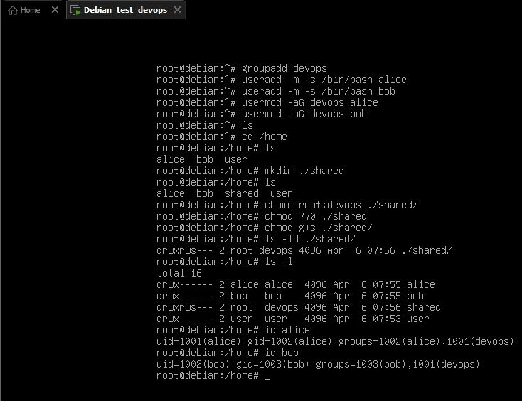
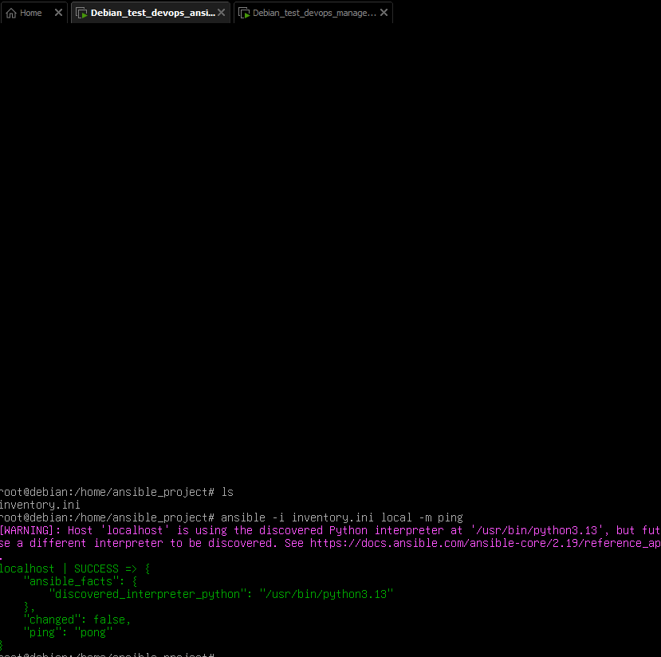
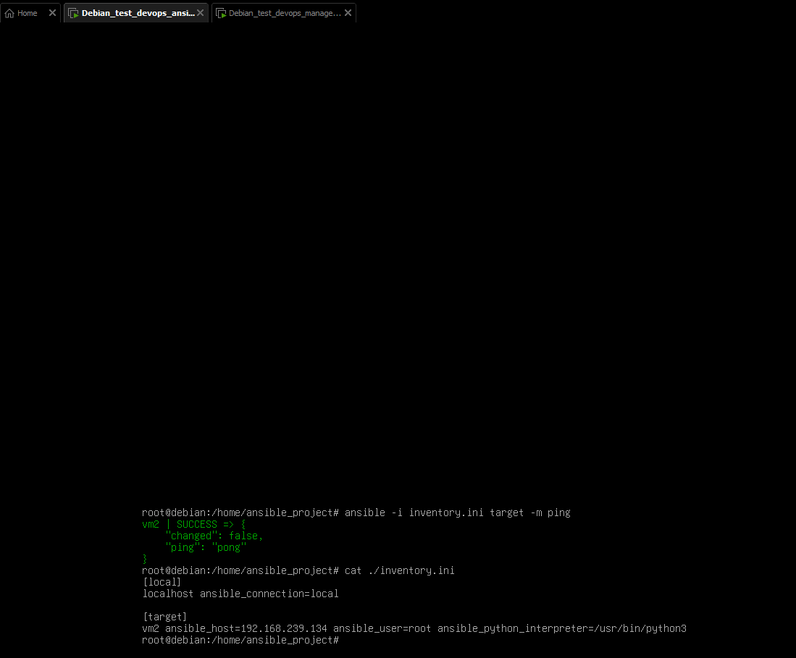
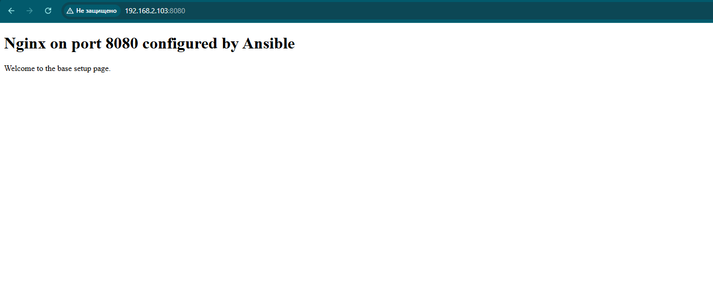
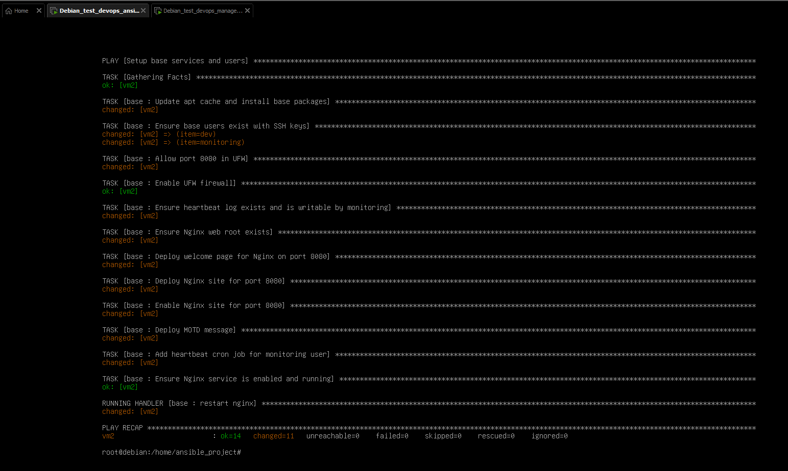
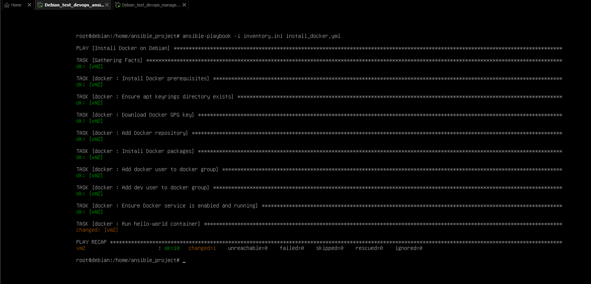
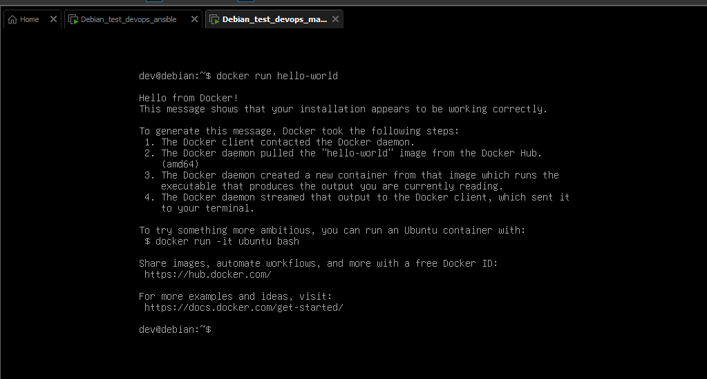
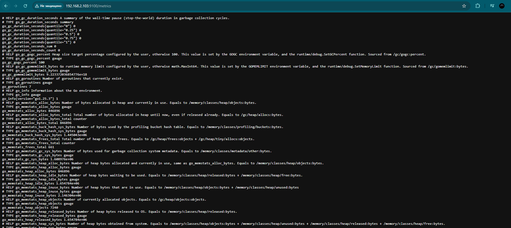
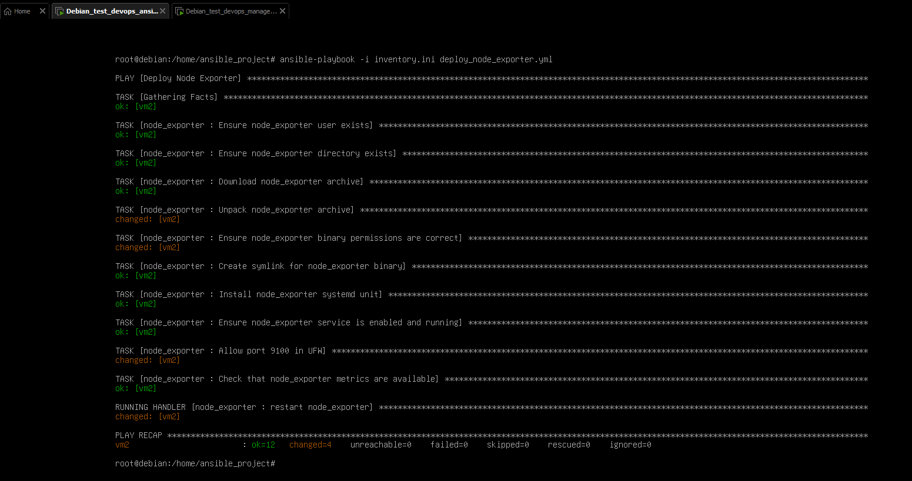

# DevOps Homework Repository

## Структура

```text
week1/
├── git/
│   └── git.md
├── img/
│   └── screen_users_and_rights.jpg
├── linux-admin/
│   ├── bash.md
│   ├── debian-setup.md
│   ├── load-average.md
│   ├── linux-permissions.md
│   ├── linux-signals.md
│   ├── systemd.md
│   └── systemd/
│       ├── myapp-log.service
│       └── myapp-log.timer
└── scripts/
    ├── log-date.sh
    └── log_parser.sh
week2/
├── roles
│   ├── base/
│   │   ├── files
│   │   │    └── motd
│   │   ├── handlers
│   │   │    └── main.yml
│   │   ├── tasks
│   │   │    └── main.yml
│   │   ├── templates
│   │   │    └── nginx-8080.conf.j2
│   ├── docker/
│   │   └── tasks
│   │       └── main.yml
│   └── node_exporter/
│   │   ├── handlers
│   │   │    └── main.yml
│   │   ├── tasks
│   │   │    └── main.yml
│   │   └── templates
│   │        └── node_exporter.service.j2
├── img
│   ├── task2.png
│   ├── task3.png
│   ├── task4-1.png
│   ├── task4-2.png
│   ├── task5-1.png
│   ├── task5-2.png
│   ├── task6-1.png
│   └── task6-2.png
├── ansible-overview.md
├── base.yml
├── docker.yml
├── inventory.ini
├── node_exporter.yml
├── site.yml
└── run-tasks.md
week3/
├── docker
│   ├── todoism/
│   │   ├── ...
│   │   └── Dockerfile
│   └── dockerfile_overview.md
```

## Переход к материалам

### Linux Admin

- [Bash](week1/linux-admin/bash.md)
- [Debian setup](week1/linux-admin/debian-setup.md)
- [Load-average](week1/linux-admin/load-average.md)
- [Linux permissions](week1/linux-admin/linux-permissions.md)
- [Linux signals](week1/linux-admin/linux-signals.md)
- [Systemd](week1/linux-admin/systemd.md)

### Git

- [Git](week1/git/git.md)

### Systemd Files

- [myapp-log.service](week1/linux-admin/systemd/myapp-log.service)
- [myapp-log.timer](week1/linux-admin/systemd/myapp-log.timer)

### Scripts

- [log-date.sh](week1/scripts/log-date.sh)
- [log_parser.sh](week1/scripts/log_parser.sh)

### Ansible

- [Ansible Overview](week2/ansible-overview.md)
- [How run tasks week2](week2/run-tasks.md)

## Docker

- [Docker Overview](week3/docker/dockerfile_overview.md)

## Дополнительно

- [Разбор вопросов](addition/questions.md)

## Week 1

### Task 1:

В директории Linux проекта создать .md файл с описанием SystemD: краткое опиcание, в каких директорях храняться манифесты, основные команды

В директории Linux проекта создать .md файл с описанием Load Average

В директории Linux проекта создать .md файл с описанием категорий прав на файл, основные команды на смену прав.

В директории Linux проекта создать .md файл с описанием что такое сигналы Linux их типы, указать основные сигналы

### Task 2:

2.1 Установите Debian из ISO-образа в VirtualBox.
- Выберите минимальную установку без GUI

2.2 После установки:
- Обновите систему
- Установите необходимые пакеты: `git`, `curl`, `tcpdump`, `htop`, `stress`, `openssl`, `vim`/`nano`

2.3 Пользователи и права
- Создайте группу `devops` и пользователей `alice` и `bob`.
- Настройте общую директорию `/shared` с правами: только участники группы могут читать/писать.
- Проверьте права с помощью `ls -l` и `id`.

2.4 Systemd и journald
- Напишите простой bash-скрипт, который записывает текущую дату в `/var/log/myapp.log`.
- Создайте systemd-юнит и таймер для запуска скрипта каждые 2 минуты.
- Проверьте логи через `journalctl -u <имя_юнита>`.

2;5 TLS и SSH
- Сгенерируйте самоподписанный сертификат:
    ```bash
    openssl req -x509 -newkey rsa:2048 -keyout key.pem -out cert.pem -days 365 -nodes
    ```
- Настройте SSH-доступ по ключу (даже если локально):
- Сгенерируйте ключ (`ssh-keygen`)
- Добавьте публичный ключ в `~/.ssh/authorized_keys`
- Протестируйте вход: `ssh localhost`

Результат:

- Скриншоты
    - созданы пользователи alice и bob
    - создана группа devops
    - права на общую директорию /shared

- Текст
    - bash-скрипт
    - манифест systemd-юнита

### Screenshots



### Task 3

В директории Linux проекта создать .md файл с кратким описанием Bash, описать требования к файлу, чтоб он мог выполнится как скрипт

### Task 4

В директории `week1/scripts` добавлен bash-скрипт [log_parser.sh](week1/scripts/log_parser.sh).

Что делает скрипт:

- читает `/var/log/syslog`, а если его нет, то `/var/log/messages`
- выбирает строки за последние 10 минут
- ищет строки с `error`, `fail`, `critical` без учета регистра
- сохраняет найденные строки в файл `errors_$(date +%F).log`
- отправляет содержимое через POST на `https://httpbin.org/post`
- если лог-файл не найден, завершает работу с кодом `1`
- если отправка не удалась, делает до 3 попыток с паузой 10 секунд

Запуск:

```bash
chmod +x week1/scripts/log_parser.sh
./week1/scripts/log_parser.sh
```

Если удобнее, можно запустить и так:

```bash
bash week1/scripts/log_parser.sh
```

### Task 5

В директории Git проекта создан файл [git.md](week1/git/git.md) с кратким описанием Git и его основных команд.

### Task 6

1. Создайте публичный проект на [GitLab.com] https://gitlab.com/.
2. Инициализируйте локальный репозиторий в папке с вашими заданиями:
```bash
git init
git remote add origin https://gitlab.com/<ваш-логин>/devops-week1.git
```
3. Реализуйте упрощённый Git Flow:
- `main` — стабильная версия (изначально пустая)
- `develop` — основная ветка разработки
- `feature/log-parser` — ветка для скрипта из задания 4
4. Создайте Merge Request (MR) из `feature/log-parser` в `develop`.
- В описании MR укажите:
- Цель: «Добавление утилиты парсинга логов»
- Как запустить
- Пример вывода
5. Включите code review — даже если нет реального ревьюера, добавьте комментарий от себя:
_«[Self-review] Проверил обработку ошибок и совместимость с Debian 12»_

## Week 2

### Task 1

В директории Ansible проекта создать .md файл с описанием возможностей и компонентов Ansilbe, а также best practices по написанию playbook.
Развернуть 2 ВМ (Ansible + Linux для настройки)

### Task 2

2.1. В вашей Debian-VM (из недели 1):
- Установите Ansible через `apt`:
```bash
sudo apt update && sudo apt install -y ansible
```
- Проверьте версию: `ansible --version`


2.2 Настройте Ansible для работы с localhost без пароля:
- Добавьте в `/etc/ansible/hosts` группу `[local]` с `localhost ansible_connection=local`
- Или создайте свой `inventory.ini` в рабочей директории.

Результат: команда `ansible local -m ping` возвращает `SUCCESS`.



### Task 3

3.1 Настройте, чтобы Ansible могла управлять второй VM



### Task 4

Создайте плейбук `setup_base.yml`, который:

- Открывает 8080 порт в Firewall

- Создаёт двух пользователей: `dev` и `monitoring` (без пароля, с домашними каталогами)
- Создает SSH-ключи для этих пользователей
- Устанавливает пакеты: `htop`, `curl`, `git`, `unzip`, `nginx`,

- Создается файл конфигурации Nginx для работы на порту 8080
- Копирует файл `motd` в `/etc/motd` с приветственным сообщением
- Добавляет cron-задачу для `monitoring`: каждые 5 минут записывает дату в `/var/log/heartbeat.log`

Результат: плейбук запускается без ошибок, всё настроено. При обращении на порт 8080 отображается приветственная страничка Nginx
Протестируйте вручную.




### Task 5

Создайте плейбук `install_docker.yml`, который:

- Устанавливает Docker на Debian (по официальной инструкции через `apt`, но автоматизированно):
- Добавляет GPG-ключ Docker
- Добавляет репозиторий
- Устанавливает `docker-ce`, `docker-ce-cli`, `containerd.io`
- Добавляет пользователя `dev` в группу `docker`
- Запускает и включает службу `docker`
- Запускает тестовый контейнер `hello-world` через модуль `docker_container`

Подсказка: используйте модули `apt_key`, `apt_repository`, `apt`, `user`, `systemd`, `docker_container`.

Результат: `docker run hello-world` работает от пользователя `dev`.




### Task 6

Создайте плейбук `deploy_node_exporter.yml`, который:

- Скачивает актуальный релиз Node Exporter (например, `v1.8.0`) с GitHub через `get_url`
- Распаковывает архив в `/opt/node_exporter`
- Создаёт символическую ссылку `/usr/local/bin/node_exporter`
- Создаёт systemd-юнит для запуска Node Exporter на порту `9100`
- Запускает и включает службу
- Проверяет, что метрики доступны: `curl http://localhost:9100/metrics`

Результат: сервис работает, метрики отдаются.




### Task 7

7.1. Преобразуйте ваши плейбуки в роли:
- `roles/base` — пользователи, ПО, motd, cron
- `roles/docker` — установка Docker
- `roles/node_exporter` — установка и запуск экспортера

7.2. Создайте главный плейбук `site.yml`, который применяет все три роли к `local`.

7.3. Загрузите всё в GitLab:
- Создайте новый проект `devops-week2`
- Структура репозитория:
```
/roles
/base
/docker
/node_exporter
inventory.ini
site.yml
README.md
```

7.4. В `README.md` опишите:
- Как запустить: `ansible-playbook -i inventory.ini site.yml`
- Требования (Debian, sudo без пароля для текущего пользователя)
- Что делает каждая роль

Результат: репозиторий на GitLab.com с рабочей структурой ролей и инструкцией.

## Week 3

### Docker

#### Task 1

В директории Docker проекта создать .md файл с описанием best practices по созданию Dockerfile

#### Task 2

Склонируйте репозиторий https://github.com/greyli/todoism

Для этого приложения напишите Dockerfile

[Посмотреть Dockerfile](week3/docker/todoism/Dockerfile)